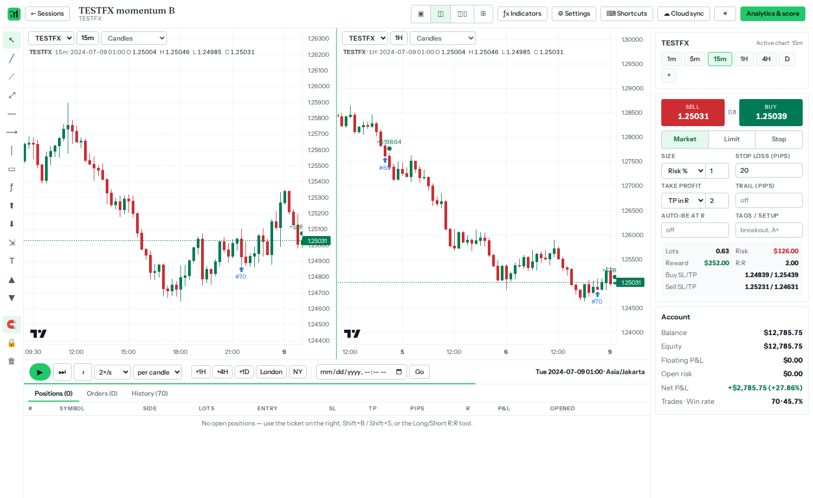
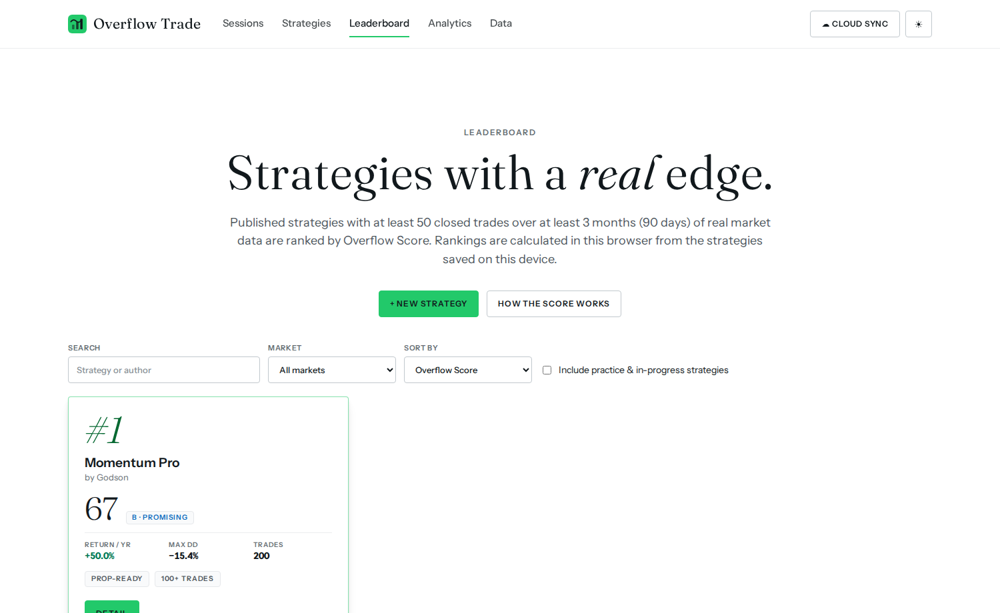
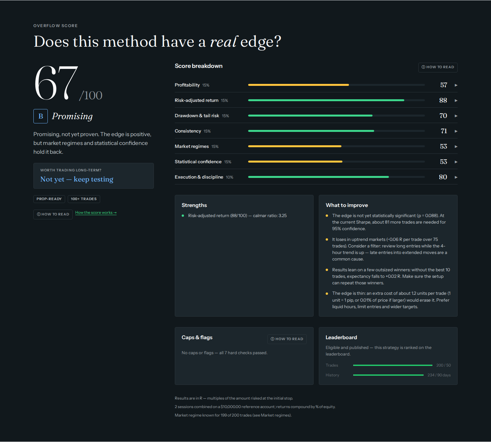
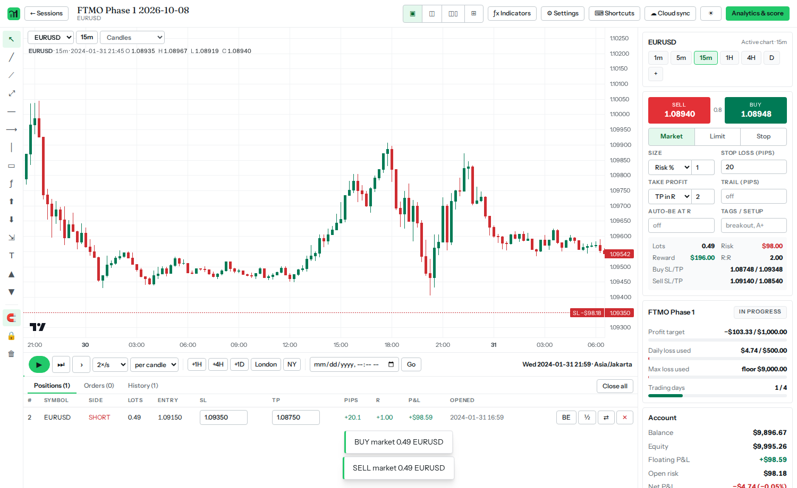

# Overflow Trade — Market Replay & Backtesting

**Overflow Trade** adalah platform *market replay* dan *manual backtesting*. Kamu bisa replay chart bar-per-bar dengan data masa depan tersembunyi, trading dengan order engine sungguhan, lalu membedah performa lewat analytics kelas quant. Setiap backtest mendapat **Overflow Score** (0–100) yang menjawab satu pertanyaan: apakah metode ini benar-benar punya *edge*?

Aplikasinya berjalan **100% di browser** (IndexedDB), jadi bisa dipakai tanpa server. Kalau Supabase diaktifkan, tersedia **login dan sinkron cloud** antar perangkat.



## Fitur

### Replay
- **Timeframe tanpa batas.** Ketik timeframe apa saja: `1m 3m 7m 13m 45m 90m 2H 3H 6H 8H 12H D 2D 3D W 2W M 3M`, bahkan `45s` kalau datamu per detik. Semua candle diagregasi dari data dasar (1 menit).
- **Candle yang sedang terbentuk.** Di chart 4H, candle yang belum close tumbuh menit demi menit, persis seperti live.
- **Multi-chart:** layout 1/2/3/4 chart. Tiap pane punya symbol dan timeframe sendiri, dan semuanya tersinkron ke jam replay yang sama.
- **Multi-symbol:** satu session bisa berisi beberapa pair (EURUSD + GBPUSD + XAUUSD…), semuanya tersinkron waktu.
- **Kontrol replay:** Play/Pause, next candle, next tick 1m, kecepatan 0.5–100×/detik, lompat +1H/+4H/+1D, lompat ke London/NY open, lompat ke tanggal tertentu. Kamu hanya bisa maju, jadi tidak bisa mengintip hasilnya.
- **Tipe chart:** Candles, Hollow candles, Heikin Ashi, OHLC bars, Line, Area (per pane).
- **Crosshair tersinkron** di semua chart, walaupun beda timeframe.
- **Klik-kanan di chart** untuk Buy/Sell Limit/Stop di harga itu (tipe order dipilih otomatis), market order, atau horizontal line.
- **Timezone chart:** UTC, Jakarta, New York (DST otomatis), London, dll. Candle harian ikut timezone.

### Prop Firm Challenge mode
Simulasi evaluasi akun funded: preset **FTMO Phase 1/2, The5ers, Funding Pips, trailing drawdown**, atau aturan custom. Aturannya: profit target, max daily loss, max total loss (bisa trailing), dan minimal hari trading. Aturan dicek terhadap **equity** (floating ikut dihitung) di setiap bar 1 menit. Kalau batas tembus, semua posisi ditutup dan trading dikunci. Progres tampil live di panel samping, lalu hasil LULUS/GAGAL tercatat di analytics.

### Trading engine
- Order Market / Limit / Stop dengan SL & TP.
- **Eksekusi di resolusi 1 menit** di timeframe apa pun. SL/TP/pending order dicek setiap bar 1m, termasuk saat price gap.
- Opsi konservatif: kalau SL dan TP tersentuh di bar yang sama, SL dianggap kena duluan.
- Position sizing: Risk %, Risk $, atau Lots; TP dalam R atau pips.
- Trailing stop, auto-breakeven di X R, partial close (½), reverse, BE satu klik, close all.
- **Drag garis SL/TP/entry langsung di chart**, atau edit angkanya di tabel posisi.
- Spread dan komisi per lot. Konversi P&L untuk pair USD-quote, USD-base (USDJPY), emas, dan crypto.
- **MAE/MFE** dicatat untuk setiap trade.

### Drawing tools
Trend line, ray, extended line, horizontal line/ray, vertical line, rectangle, Fibonacci retracement, **tool Long/Short position (R:R)** yang bisa langsung dijadikan order sungguhan, measure, text, dan arrow. Tersedia magnet (snap ke OHLC), drag handle, ganti warna, dan hapus. Drawing tersimpan per symbol, jadi terlihat di semua timeframe.

### Indikator
SMA, EMA, Bollinger Bands, VWAP harian, Donchian, RSI, MACD, ATR, Stochastic, Volume. Parameternya bisa diubah per pane.

### Overflow Score
Satu angka 0–100 dari **7 pilar** dengan bobot tetap:
- Profitabilitas: expectancy dalam R, profit factor, CAGR.
- Return yang disesuaikan risiko: Sharpe, Sortino, Calmar.
- Drawdown & tail risk: max DD, Ulcer index, CVaR, peluang DD 30%.
- Konsistensi: % bulan profit, bulan terburuk vs rata-rata bulanan, R² equity, paruh pertama vs kedua.
- **Kondisi market:** trending naik/turun, ranging, volatilitas rendah/normal/tinggi.
- Keyakinan statistik: jumlah trade, p-value, PSR, batas bawah CI 95%, ketergantungan pada trade outlier.
- Eksekusi: ketahanan terhadap biaya, pemakaian stop loss, konsistensi risiko.

**Hard cap** menahan skor untuk kelemahan fatal:
- kurang dari 30 trade, atau periode tes di bawah 3 bulan;
- expectancy ≤ 0 atau drawdown di atas 30%;
- edge yang hilang tanpa 5% trade terbaik, atau rugi di sebagian besar rezim market;
- bulan terburuk yang rugi melebihi rata-rata profit sebulan.

Hasilnya:
- **Grade** dari A+ sampai F, dengan verdict "Worth trading long-term?".
- **Saran perbaikan** otomatis, misalnya filter rezim, batas rugi bulanan, atau ukuran risiko.
- Label **All-weather** hanya diberikan kalau skor ≥ 80 dan semua syarat ini terpenuhi:
  - profit saat ranging *dan* saat trending;
  - tidak rugi di rezim volatilitas mana pun;
  - DD ≤ 20%;
  - signifikan (p < 0.05);
  - tidak ada bulan yang rugi lebih dari rata-rata bulanan.

Rumus lengkapnya ada di halaman **Methodology**, yang dirender langsung dari `src/analytics/score.ts`.

### Analytics (kelas quant)
Setiap tool punya panel **"How to read"**: apa yang diukur, cara membaca, seperti apa yang bagus, dan hal yang perlu diwaspadai.
- **Performance:** KPI, equity curve dan drawdown *underwater*, serta 30+ statistik (payoff, SQN, Kelly, streak, MAE/MFE, edge ratio, dll.).
- **Risk:** Sharpe/Sortino/Calmar/Martin/Gain-to-pain, VaR & CVaR 95% per trade dan per hari, serta losing streak aktual vs yang diharapkan secara statistik.
- **Consistency:** aturan bulanan (bulan terburuk vs rata-rata), tabel return bulanan, rolling expectancy, paruh pertama vs kedua, dan kalender P&L.
- **Market regimes:** setiap trade diberi tag kondisi market chart 4H saat entry (ADX/ATR, tanpa lookahead), ditampilkan sebagai heatmap tren × volatilitas.
- **Statistical confidence:** t-test, bootstrap CI 95%, Probabilistic & Deflated Sharpe, dan jumlah trade yang masih dibutuhkan.
- **Robustness:** stress test biaya (+1/+2 unit), titik impas biaya, hasil tanpa 5% trade terbaik, profit capture, dan konsistensi risiko.
- **Monte Carlo:**
  - Bootstrap atau shuffle, skip trade, dan biaya tambahan.
  - Fan chart, histogram max DD, dan tabel risk of ruin.
  - **Simulasi position sizing** (0.25–3% risiko).
  - **Simulator prop-firm** (peluang lulus FTMO dkk.).
- **Breakdown & distribusi:** per hari, jam, market session, symbol, side, tag, exit, holding, bulan, psikologi (setelah win/loss, trade ke-N), R-multiple, dan MAE/MFE.
- **Jurnal:** screenshot otomatis, tag, catatan, rating, dan export CSV. Filter tersedia untuk symbol, side, tag, exit, dan tanggal.

### Strategy & Leaderboard
- **Strategy** menggabungkan beberapa session yang memakai aturan sama (symbol dan periode bebas) menjadi satu track record dan satu skor. Setiap trade dihitung sebagai % equity, jadi ukuran akun yang berbeda tetap adil.
- **Leaderboard** (lokal, di browser ini) meranking strategy berdasarkan Overflow Score. Syaratnya:
  - di-publish;
  - **≥ 50 trade dalam ≥ 3 bulan**;
  - memakai data market asli (data sintetis/demo tidak pernah diranking).
- Badge: All-weather, Prop-ready, 100+ trades, 1-year record, Significant.
- Tombol **Detail** membuka analytics lengkap strategy. Strategy yang belum memenuhi syarat tampil dengan alasan dan progresnya.



### Backup/restore
Semua session dan strategy (termasuk trade, drawing, jurnal, dan screenshot) bisa dibackup ke satu file JSON dengan format v2. File v1 lama tetap bisa direstore. Data market bisa diexport ke CSV.





## Login & sinkron cloud (Supabase)

Aplikasi bisa dipakai tanpa login (data tersimpan di browser). Kalau mau akun dan sinkron antar perangkat (laptop ↔ HP ↔ PC kantor):

1. Buat project gratis di [supabase.com](https://supabase.com/dashboard).
2. Buka **SQL Editor**, tempel isi [`supabase/schema.sql`](supabase/schema.sql), lalu **Run**. Ini membuat tabel `sessions` dan `shots` serta bucket `datasets`, lengkap dengan Row Level Security, sehingga tiap user hanya bisa mengakses datanya sendiri.
3. Ambil **Project URL** dan **anon public key** di *Project Settings → API*, lalu pilih salah satu:
   - **Untuk website publik:** simpan sebagai GitHub Secrets `VITE_SUPABASE_URL` dan `VITE_SUPABASE_ANON_KEY`. Workflow deploy akan memasukkannya ke build, dan semua pengunjung langsung melihat tombol **Sign in**. Untuk lokal, taruh di file `.env.local`.
   - **Tanpa rebuild:** klik **☁ Cloud sync** di aplikasi, lalu tempel URL dan key-nya.
4. *(Opsional)* Di *Authentication → Providers → Email*, matikan "Confirm email" kalau ingin user bisa langsung masuk tanpa verifikasi email.

Yang tersinkron:
- **Otomatis:** session, trade, drawing, catatan jurnal, screenshot, dan status challenge. Konflik diselesaikan dengan *last write wins* per session, dan penghapusan ikut tersinkron.
- **Data market:** tombol **Upload** per symbol di tab Data mengunggah file terkompresi (sekitar 10 MB per tahun data 1 menit). Di perangkat lain, data diunduh otomatis saat session membutuhkannya.

> Anon key memang dirancang untuk dipakai di frontend. Keamanannya dijamin oleh Row Level Security di `schema.sql`. Jangan pernah memasukkan `service_role` key ke aplikasi.

## Menjalankan

```bash
npm install
npm run dev       # http://localhost:5173
npm test          # unit test engine (timeframe, broker, csv, statistik quant, score, leaderboard)
npm run build     # hasil static di dist/, bisa di-host di mana saja
```

Buka aplikasinya, klik **Load demo data** (EURUSD, GBPUSD, XAUUSD sintetis 1 tahun), lalu **+ New session**.

### Deploy
`dist/` adalah website statis murni, jadi bisa di-deploy ke GitHub Pages, Netlify, Vercel, Cloudflare Pages, atau nginx. Workflow `.github/workflows/deploy.yml` otomatis menjalankan test, build, lalu deploy ke GitHub Pages setiap push ke `main`. Aktifkan dulu lewat *Settings → Pages → Source: GitHub Actions*.

## Data historis

| Sumber | Cara |
|---|---|
| **Forex 1m gratis** | histdata.com → ASCII / 1-Minute Bar. Import dengan offset `-5` (EST tanpa DST). |
| **Dukascopy** | Export CSV 1-minute (UTC), bisa lewat `npx dukascopy-node`. |
| **MT4 / MT5** | History Center → Export. Offset = timezone server broker (biasanya +2/+3). |
| **Crypto** | Tombol **Binance** di tab Data, download 1m langsung dari API publik. |

Parser CSV mendeteksi format secara otomatis. Import symbol yang sama berkali-kali akan **menggabungkan** datanya. Pip size, contract size, dan digits bisa diedit per symbol.

## Shortcut keyboard

| Tombol | Aksi |
|---|---|
| `Space` | Play / pause |
| `→` / `Shift+→` | Candle berikutnya / tick 1m berikutnya |
| `Shift+B` / `Shift+S` | Market buy / sell |
| `Shift+C` | Close all |
| ketik `15`, `4h`, `d`… | Ganti timeframe |
| `Alt+T/H/V/R/F/L/S/M` | Trend, H-line, V-line, Rect, Fib, Long, Short, Measure |
| `Alt+1…4` | Layout 1–4 chart |
| `Del` | Hapus drawing terpilih |

## Arsitektur

```
src/
  core/        timeframe.ts (parser + agregasi TF apa pun), tz.ts, indicators.ts, types.ts
  data/        csv.ts, binance.ts, synthetic.ts, store.ts (IndexedDB), sessions.ts, strategies.ts, sync.ts (engine sinkron), cloud.ts (Supabase)
  engine/      broker.ts (order, fill, SL/TP, MAE/MFE), replay.ts (jam replay multi-symbol), rules.ts (prop firm challenge)
  analytics/   records.ts (trade ternormalisasi), regime.ts (tag kondisi market 4H), report.ts (semua metrik quant),
               score.ts (Overflow Score: pilar, gate, grade, saran), montecarlo.ts, service.ts (pipeline + leaderboard),
               explain.ts (teks "How to read"), math.ts, stats.ts
  ui/          workspace, chartpane (Lightweight Charts), drawings (canvas overlay), analytics (+ an-score, an-montecarlo,
               an-widgets), strategies, leaderboard, methodology, layout (header/section/kartu), charts (SVG)
```

Chart menggunakan [TradingView Lightweight Charts](https://github.com/tradingview/lightweight-charts) (Apache-2.0).
